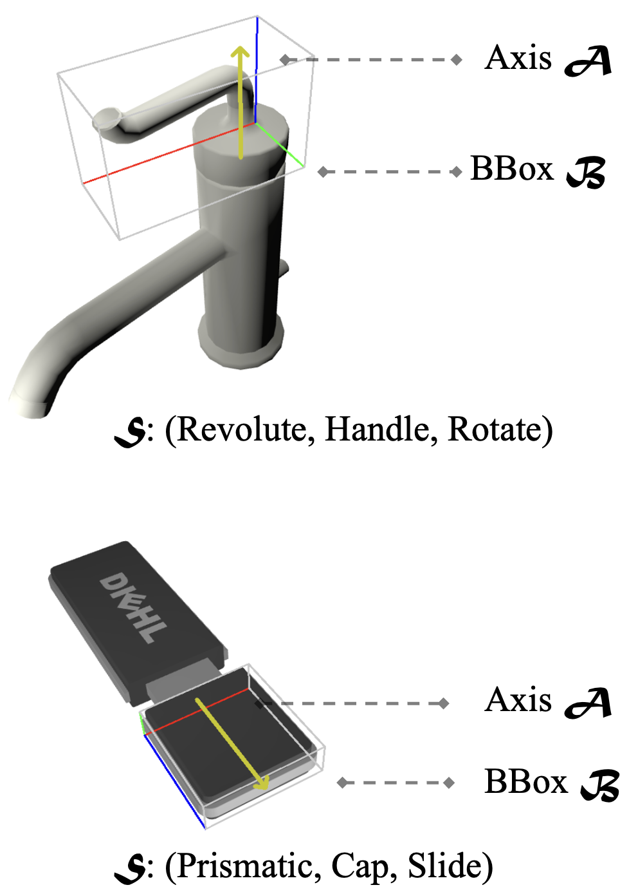
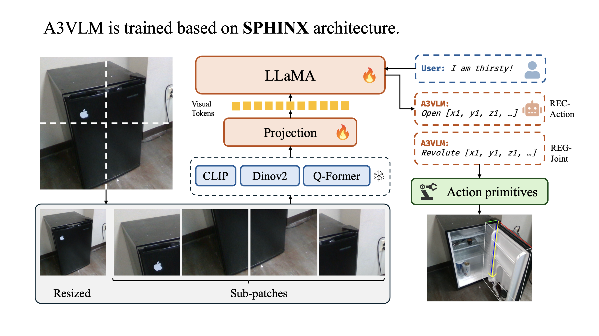
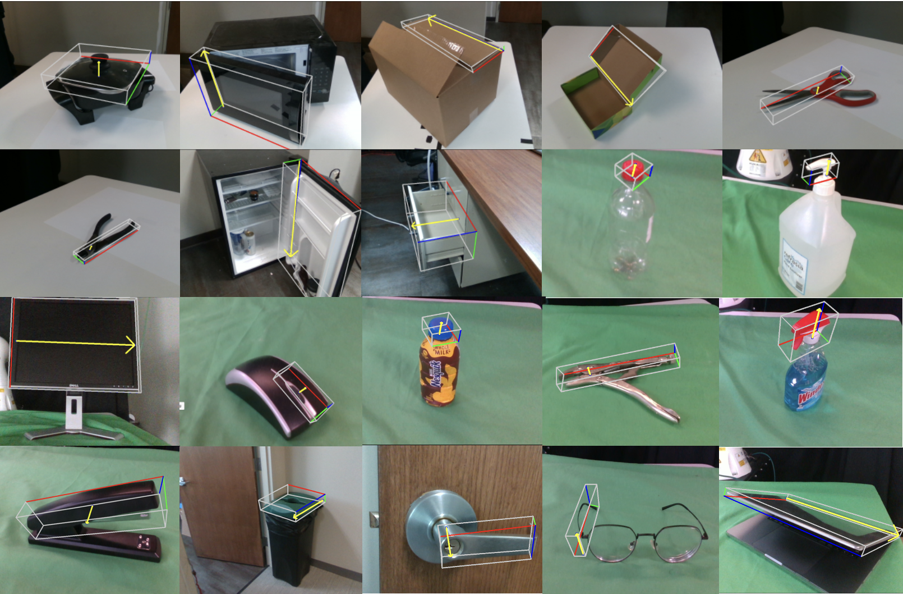

# A3VLM

```
Official repo of `A3VLM: Actionable Articulation-Aware Vision Language Model`.
```

🎆🎆 **A3VLM has been accepted into CoRL2024!!**.

Vision Language Models (VLMs) have received significant attention in recent years in the robotics community. VLMs are shown to be able to perform complex visual reasoning and scene understanding tasks, which makes them regarded as a potential universal solution for general robotics problems such as manipulation and navigation. However, previous VLMs for robotics such as RT-1, RT-2, and ManipLLM have focused on directly learning robot-centric actions. Such approaches require collecting a significant amount of robot interaction data, which is extremely costly in the real world. Thus, we propose A3VLM, an object-centric, actionable, articulation-aware vision language model. A3VLM focuses on the articulation structure and action affordances of objects. Its representation is robot-agnostic and can be translated into robot actions using simple action primitives. Extensive experiments in both simulation benchmarks and real-world settings demonstrate the effectiveness and stability of A3VLM.

<div align="center">
  
</div>

### File Structure

To generate training data and perform evaluation, check `data_gen`. To train, fine-tune, or inference using A3VLM, check `model`.

### Articulation Annotation for Action

A3VLM uses a triad $(\mathcal{B}, \mathcal{A}, \mathcal{S})$ to represent the articulation structure and action affordance.

<p align="center">

</p>

Such representation can be easily translated to actions using simple action primitives, such as slide, rotate and scroll.


### MLLM

<p align="center">

</p>

### Demos on real-world

A3VLM can be directly depolyed to real-world settings and be able to perform inference on many different types of objects.

<p align="center">

</p>

### Reference
If you find A3VLM to be helpful to your project, please cite us by:
```
@article{huang2024a3vlm,
  title={A3VLM: Actionable Articulation-Aware Vision Language Model},
  author={Huang, Siyuan and Chang, Haonan and Liu, Yuhan and Zhu, Yimeng and Dong, Hao and Gao, Peng and Boularias, Abdeslam and Li, Hongsheng},
  journal={arXiv preprint arXiv:2406.07549},
  year={2024}
}
```
