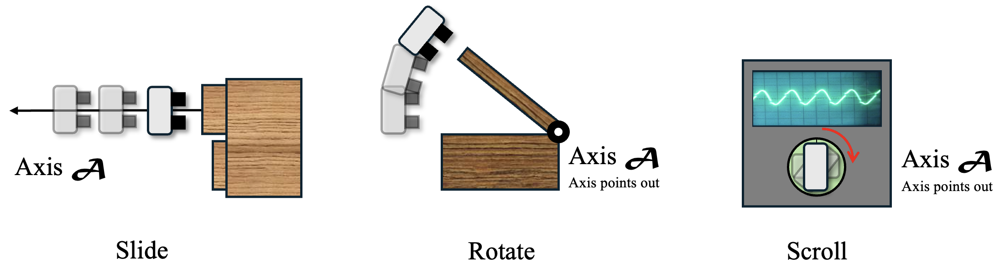

# A3VLM

Offical repo of `A3VLM: Actionable Articulation-Aware
Vision Language Model`.

To generate training data and perform evaluation, check `data_gen`. To train, fine-tune, or inference using A3VLM, check `model`.

### Articulation Annotation for Action

A3VLM uses a triad $(\mathcal{B}, \mathcal{A}, \mathcal{S})$ to represent the articulation structure and action affordance.

Such representation can be easily translated to actions using simple action primitives, such as slide, rotate and scroll.

### Demos on real-world

A3VLM can be directly depolyed to real-world settings and be able to perform inference on many different types of objects.

